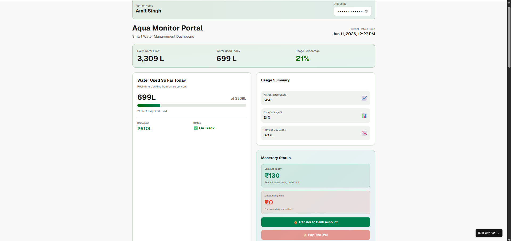
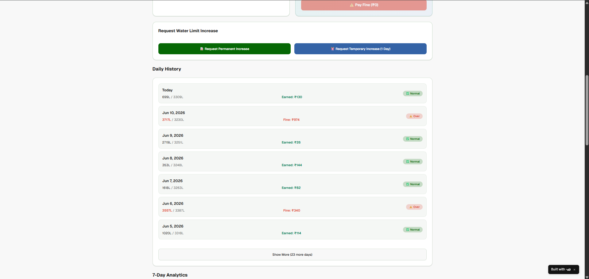
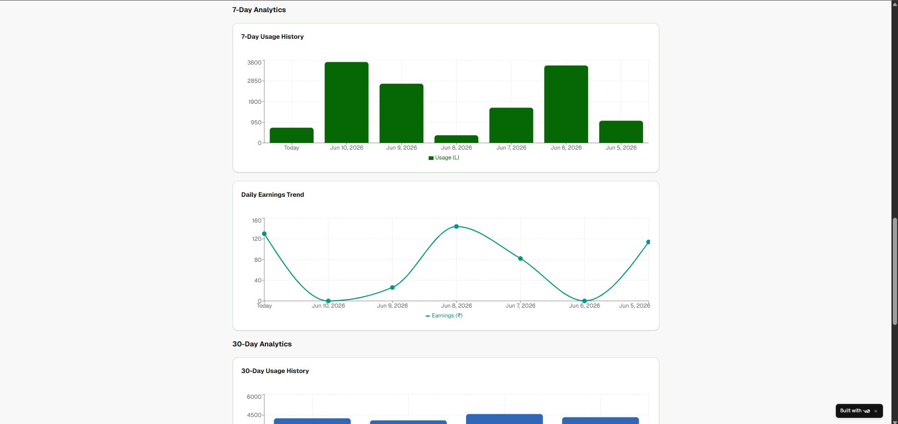
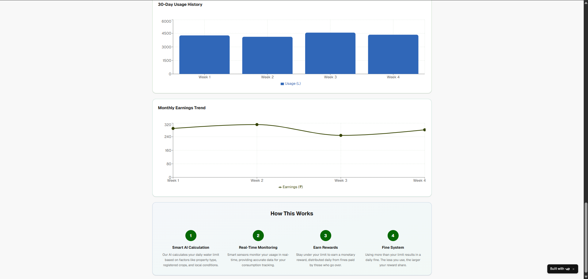

# Aqua Monitor Portal

Aqua Monitor Portal is a smart water management dashboard designed to help farmers monitor their water usage and manage water limits efficiently. The dashboard provides usage statistics, analytics, rewards, and fine tracking to encourage responsible water consumption.

## Live Demo

https://v0-farmer-water-dashboard.vercel.app/

## Features

- Water usage monitoring
- Daily water limit tracking
- Usage analytics
- Rewards and fine management
- Water limit increase requests
- Simple and responsive dashboard UI

## Built With

- v0.dev
- Next.js
- React
- TypeScript
- Tailwind CSS
- Vercel

## Screenshots

### Dashboard Overview

### Daily History & Water Limit Requests

### 7-Day Analytics

### 30-Day Analytics & System Workflow

## Future Improvements

- IoT sensor integration
- AI-based water usage predictions
- Mobile app support
- Advanced analytics

## Author

Developed as a project for smart agricultural water management.
